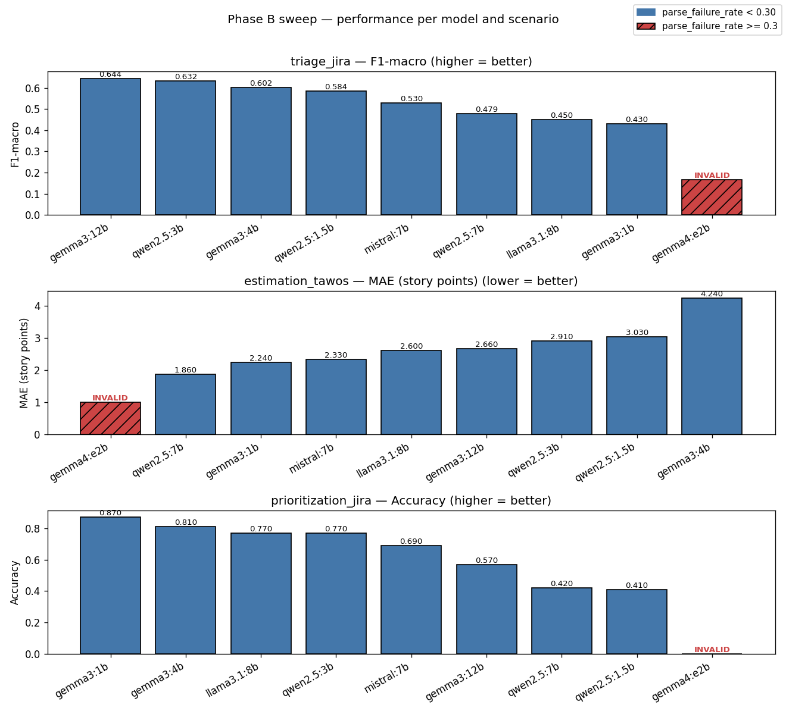
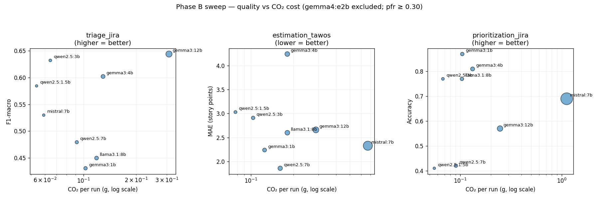
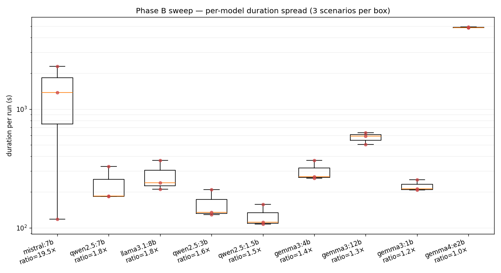

# Phase B Results — Multi-Model Evaluation on PMO Tasks

## Executive summary

Phase B evaluated 9 local LLMs across 3 PMO scenarios (issue triage,
story-point estimation, pairwise prioritization) on the project's
reference `gpu-entry` hardware (RTX 2060 Mobile, 6 GB VRAM, 32 GB
DDR4). Each (model, scenario) pair ran 100 instances under the
`contextual-anchoring` adaptation strategy with `seed=42` and
`temperature=0.0`, producing 27 runs persisted to `data/puma.db`. The
sweep took 6 h 41 m total wall clock and consumed 67.5 Wh / 11.75 g
CO₂ (CPU+RAM only — see Limitations on CodeCarbon GPU detection).

Three findings stand out:

1. **No single model wins.** Each scenario has a different best
   performer: `gemma3:12b` for triage (F1=0.644), `qwen2.5:7b` for
   estimation (MAE=1.86), `gemma3:1b` for prioritization (acc=0.87).
2. **Scaling is not monotonic** within model families on these PMO
   tasks. `gemma3:1b` outperforms `gemma3:12b` on prioritization
   (0.87 vs 0.57). `qwen2.5:3b` outperforms `qwen2.5:7b` on triage
   (0.632 vs 0.479). Smaller models can be both better and cheaper.
3. **Parser × hardware incompatibility wastes more compute than the
   useful experiment combined.** The `gemma4:e2b` runs alone consumed
   60.5 % of the sweep's CO₂ while producing parse_failure_rate
   ≥ 0.98 in all three scenarios — no analytically usable output.

These results support PUMA's working hypothesis that small local LLMs
are viable for some PMO tasks, while clearly bounding the conditions
under which they are.

## Methodology

**Sweep configuration.** Specs were generated programmatically as
9 × 3 = 27 YAML files of the form `<model_safe>__<scenario>.yaml`
(generation script kept transient; reproducibility relies on the
preserved `spec_yaml` column in the `runs` table per run row, which
allows exact regeneration from the database). Each spec set
`scenario`, `models: [<tag>]`, `sample_size: 100`,
`adaptation.strategy: [contextual-anchoring]`, `inference.seed: 42`,
`inference.temperature: 0.0`, `sustainability.codecarbon: true`,
`repeat: 1`.

**Hardware and execution profile.** All runs were executed on the
project's reference machine (see `docs/HARDWARE.md`): MSI GS66
laptop with i7-10750H, 32 GB DDR4-2667, RTX 2060 Mobile (6 GB GDDR6).
The detected execution profile was `gpu-entry` (6 GB ≤ VRAM < 12 GB).
Models were dispatched dynamically via
`puma.preflight.catalog.models_for_profile('gpu-entry')`, the
single-source-of-truth API introduced in B.1.3.

**Metrics computed per scenario.** `triage_jira` reports F1-macro
(higher is better) over four severity classes (Critical / Major /
Minor / Trivial). `estimation_tawos` reports MAE in story points
(lower is better) on Fibonacci-snapped predictions. `prioritization_jira`
reports accuracy (higher is better) on a binary A/B pairwise task.
All scenarios additionally report `parse_failure_rate` (fraction of
instances where the model output could not be parsed into a valid
label) and per-class breakdown via `puma.metrics`.

**Models excluded and reasoning.**
`deepseek-r1:7b` was excluded from the sweep because its
parse_failure_rate in a 5-instance smoke (B.2.5) was 0.8: the model
emits chain-of-thought blocks that the current scenario parsers do
not strip. This is tracked as open debt #D17. The Gemma4 MoE variants
`gemma4:e4b` and `gemma4:26b-a4b` were excluded because they cannot
be empirically size-verified on this hardware (debt #D16). All other
catalog models compatible with `gpu-entry` were included.

**Reproducibility note.** The reference baseline of v2.0.0
(F1=0.5867 ± 0.01 for `qwen2.5:3b` × `contextual-anchoring` ×
seed=42 × triage_jira × 200 instances) was preserved through the
sweep: re-running `specs/runs/baseline_triage.yaml` after the sweep
yielded F1=0.5894 (Δ=+0.0027), within tolerance. Datasets are tracked
CSVs (`data/jira_balanced_200.csv`, `data/tawos_clean.csv`); the
SHA-256 of each is implicit in the spec_hash recorded with each run.
CodeCarbon emission rows in `data/puma.db` are joinable to runs by
`run_id` for full per-run sustainability traceability.

## Results overview

The bar chart above gives the at-a-glance view of native quality per
(model, scenario). Bars hatched in red mark runs with
`parse_failure_rate ≥ 0.30` (the `gemma4:e2b` rows across all three
scenarios), where the displayed metric value is an artefact of a tiny
denominator and should be read as "no usable output".

The Pareto-style scatter highlights the cost–quality trade-off per
scenario. Marker size encodes per-run duration. `gemma4:e2b` is
excluded because its `parse_failure_rate ≥ 0.98` makes the points
non-comparable. Within each scenario the lower-right quadrant is
the most desirable region (low CO₂, good quality).

The duration boxplot (log y-axis) sorts models by max/min duration
ratio. `mistral:7b` stands out with a 19.5× spread across the three
scenarios on the same hardware in the same session, consistent with
thermal throttling on the laptop reference machine (debt #D20).

## Results by scenario

### triage_jira (F1-macro)

| Model | F1 | parse_fail | duration (s) | energy (Wh) | CO₂ (g) |
|-------|---:|-----------:|-------------:|------------:|--------:|
| gemma3:12b      | 0.6440 | 0.000 |  631 |  1.77 | 0.31 |
| qwen2.5:3b      | 0.6321 | 0.000 |  129 |  0.37 | 0.06 |
| gemma3:4b       | 0.6021 | 0.000 |  262 |  0.74 | 0.13 |
| qwen2.5:1.5b    | 0.5844 | 0.000 |  107 |  0.31 | 0.05 |
| mistral:7b      | 0.5298 | 0.000 |  118 |  0.34 | 0.06 |
| qwen2.5:7b      | 0.4792 | 0.000 |  185 |  0.53 | 0.09 |
| llama3.1:8b     | 0.4495 | 0.000 |  240 |  0.68 | 0.12 |
| gemma3:1b       | 0.4304 | 0.000 |  208 |  0.59 | 0.10 |
| gemma4:e2b      | 0.1667 | 0.980 | 4851 | 13.55 | 2.36 (invalid: pfr=0.98) |

`gemma3:12b` leads but at 5× the CO₂ cost of `qwen2.5:3b` (0.31 g
vs 0.06 g) for only +0.012 absolute F1. The two `qwen2.5` models
(1.5b and 3b) and `mistral:7b` form a tight efficiency cluster
between F1=0.53 and F1=0.63 at near-identical sub-0.07 g CO₂ cost.
`qwen2.5:7b` underperforms `qwen2.5:3b` (intra-family non-monotonicity
detailed below).

### estimation_tawos (MAE in story points; lower is better)

| Model | MAE | parse_fail | duration (s) | energy (Wh) | CO₂ (g) |
|-------|----:|-----------:|-------------:|------------:|--------:|
| qwen2.5:7b      | 1.860 | 0.000 |  328 |  0.93 | 0.16 |
| gemma3:1b       | 2.240 | 0.000 |  254 |  0.72 | 0.13 |
| mistral:7b      | 2.330 | 0.000 | 1377 |  3.85 | 0.67 |
| llama3.1:8b     | 2.600 | 0.000 |  369 |  1.04 | 0.18 |
| gemma3:12b      | 2.660 | 0.000 |  590 |  1.65 | 0.29 |
| qwen2.5:3b      | 2.910 | 0.000 |  210 |  0.60 | 0.10 |
| qwen2.5:1.5b    | 3.030 | 0.000 |  157 |  0.45 | 0.08 |
| gemma3:4b       | 4.240 | 0.000 |  369 |  1.04 | 0.18 |
| gemma4:e2b      | 1.000 | 0.990 | 4930 | 13.78 | 2.40 (invalid: pfr=0.99) |

`qwen2.5:7b` is the only model with MAE < 2 SP; it is also the most
efficient member of the top half (0.16 g CO₂). `gemma3:1b` is a
notable outlier — a 1B-parameter model achieving MAE=2.24, beating
several models 4–8× larger. `mistral:7b` ran 4× longer than the
similarly-sized `llama3.1:8b` (1377 s vs 369 s) without proportional
quality gain; this anomaly is connected to the duration variability
discussed below.

### prioritization_jira (accuracy)

| Model | Accuracy | parse_fail | duration (s) | energy (Wh) | CO₂ (g) |
|-------|---------:|-----------:|-------------:|------------:|--------:|
| gemma3:1b       | 0.87 | 0.000 |  212 |  0.60 | 0.10 |
| gemma3:4b       | 0.81 | 0.000 |  269 |  0.76 | 0.13 |
| llama3.1:8b     | 0.77 | 0.000 |  211 |  0.60 | 0.10 |
| qwen2.5:3b      | 0.77 | 0.000 |  135 |  0.39 | 0.07 |
| mistral:7b      | 0.69 | 0.000 | 2299 |  6.43 | 1.12 |
| gemma3:12b      | 0.57 | 0.000 |  504 |  1.42 | 0.25 |
| qwen2.5:7b      | 0.42 | 0.000 |  183 |  0.52 | 0.09 |
| qwen2.5:1.5b    | 0.41 | 0.000 |  111 |  0.32 | 0.06 |
| gemma4:e2b      |   —  | 1.000 | 4844 | 13.54 | 2.36 (invalid: pfr=1.00) |

The smallest model in the sweep, `gemma3:1b`, takes the top spot —
+0.06 over `gemma3:4b`, +0.30 over `gemma3:12b`. The two qwen2.5
endpoints (1.5b and 7b) score essentially at chance (0.41–0.42),
while qwen2.5:3b reaches 0.77 — a striking U-shape inside the qwen2.5
family on this task. `mistral:7b` again exhibits anomalous duration
(2299 s for the same 100 instances completed in 211 s by
`llama3.1:8b`).

## Cost-effectiveness ranking

For each scenario, the table below ranks models by quality-per-gram
of CO₂ (higher is better). Quality is F1 for triage, 1 / MAE for
estimation, accuracy for prioritization. This is a different ranking
than the absolute-quality leaderboard.

### triage_jira — F1 / g CO₂

| Rank | Model | F1 | g CO₂ | F1 per g CO₂ |
|-----:|-------|---:|------:|-------------:|
| 1 | qwen2.5:1.5b | 0.5844 | 0.0538 | **10.86** |
| 2 | qwen2.5:3b   | 0.6321 | 0.0644 |  9.82 |
| 3 | mistral:7b   | 0.5298 | 0.0591 |  8.96 |
| 4 | qwen2.5:7b   | 0.4792 | 0.0914 |  5.24 |
| 5 | gemma3:4b    | 0.6021 | 0.1293 |  4.66 |
| 6 | gemma3:1b    | 0.4304 | 0.1026 |  4.20 |
| 7 | llama3.1:8b  | 0.4495 | 0.1187 |  3.79 |
| 8 | gemma3:12b   | 0.6440 | 0.3087 |  2.09 |

### estimation_tawos — (1/MAE) / g CO₂

| Rank | Model | MAE | g CO₂ | (1/MAE) per g |
|-----:|-------|----:|------:|--------------:|
| 1 | qwen2.5:1.5b | 3.030 | 0.0779 | **4.24** |
| 2 | gemma3:1b    | 2.240 | 0.1251 |  3.57 |
| 3 | qwen2.5:7b   | 1.860 | 0.1612 |  3.34 |
| 4 | qwen2.5:3b   | 2.910 | 0.1038 |  3.31 |
| 5 | llama3.1:8b  | 2.600 | 0.1811 |  2.12 |
| 6 | gemma3:12b   | 2.660 | 0.2880 |  1.31 |
| 7 | gemma3:4b    | 4.240 | 0.1810 |  1.30 |
| 8 | mistral:7b   | 2.330 | 0.6705 |  0.64 |

### prioritization_jira — accuracy / g CO₂

| Rank | Model | Accuracy | g CO₂ | acc per g |
|-----:|-------|---------:|------:|----------:|
| 1 | qwen2.5:3b   | 0.77 | 0.0676 | **11.39** |
| 2 | gemma3:1b    | 0.87 | 0.1049 |  8.29 |
| 3 | llama3.1:8b  | 0.77 | 0.1041 |  7.40 |
| 4 | qwen2.5:1.5b | 0.41 | 0.0557 |  7.36 |
| 5 | gemma3:4b    | 0.81 | 0.1325 |  6.11 |
| 6 | qwen2.5:7b   | 0.42 | 0.0908 |  4.63 |
| 7 | gemma3:12b   | 0.57 | 0.2467 |  2.31 |
| 8 | mistral:7b   | 0.69 | 1.1189 |  0.62 |

`qwen2.5:1.5b` dominates two of three cost-effectiveness rankings
(triage and estimation) despite never appearing in the absolute-quality
top three for either scenario. This is the most consequential
downstream finding for resource-constrained deployments: the cheapest
model in the catalog is also the most efficient per-CO₂ for two
of the three PMO tasks.

## Sustainability efficiency

Aggregated per model across the 3 scenarios (sorted by total CO₂):

> **Note on CO₂ accounting (pre-D15).** B.3 emissions were captured
> with CodeCarbon `tracking_mode="process"`; GPU energy is not
> included. The total CO₂ figures below reflect CPU+RAM energy only
> and underestimate the true cost for GPU-bound runs (`gemma3:12b`,
> `gemma4:e2b`). This was identified and fixed as debt D15 in
> Sprint 2 (post-fix smoke confirms `gpu_energy > 0` in the
> `emissions` table); future sweeps will include GPU energy and will
> not be directly comparable to the pre-D15 totals on the
> `gpu_energy` / `kwh` / `co2_kg` columns.

| Model | n runs | Total runtime (min) | Total Wh | Total g CO₂ | Avg pfr |
|-------|------:|--------------------:|---------:|------------:|--------:|
| qwen2.5:1.5b | 3 |  6.3 |  1.08 | 0.187 | 0.000 |
| qwen2.5:3b   | 3 |  7.9 |  1.36 | 0.236 | 0.000 |
| gemma3:1b    | 3 | 11.2 |  1.91 | 0.333 | 0.000 |
| qwen2.5:7b   | 3 | 11.6 |  1.97 | 0.343 | 0.000 |
| llama3.1:8b  | 3 | 13.7 |  2.32 | 0.404 | 0.000 |
| gemma3:4b    | 3 | 15.0 |  2.54 | 0.443 | 0.000 |
| gemma3:12b   | 3 | 28.8 |  4.85 | 0.843 | 0.000 |
| mistral:7b   | 3 | 63.2 | 10.62 | 1.848 | 0.000 |
| **gemma4:e2b** | 3 | **243.7** | **40.87** | **7.114** | **0.990** |

### The "60% wasted compute" finding

Of the 11.75 g CO₂ consumed by the full 27-run sweep, `gemma4:e2b`
alone accounted for 7.11 g — **60.5 % of the total** — without
producing any analytically usable output (parse_failure_rate ≥ 0.98
in all 3 scenarios). The useful subset of the sweep (the 24 runs
with parsable output across the 8 non-`gemma4` models) consumed
4.64 g CO₂.

This illustrates a sustainability principle relevant to LLM
benchmarking: **a parser × hardware incompatibility can consume more
compute than the entire useful subset of an experiment combined**. In
practical terms, a misconfigured 27-run sweep that wastes 6 h 41 m
of laptop time and 67.5 Wh of energy can be salvaged in the analysis
phase, but the resources are gone. This justifies the discipline,
adopted in B.2.5, of running per-model 5-instance smoke tests on
freshly pulled models *before* committing to a full sweep — that
single discipline would have caught the gemma4 incompatibility
before allocating ~243 minutes of inference time to it.

## Empirical findings

### Non-monotonicity by family

Within each model family in the sweep, larger does not consistently
mean better on these PMO tasks:

| Family | Scenario | 1.5–1B | 3–4B | 7–12B | Pattern |
|--------|----------|-------:|-----:|------:|---------|
| gemma3 | prioritization | 0.87 (1b) | 0.81 (4b) | 0.57 (12b) | strictly decreasing |
| gemma3 | estimation MAE | 2.24 (1b) | 4.24 (4b) | 2.66 (12b) | non-monotonic (4b worst) |
| gemma3 | triage F1 | 0.430 (1b) | 0.602 (4b) | 0.644 (12b) | strictly increasing |
| qwen2.5 | prioritization | 0.41 (1.5b) | 0.77 (3b) | 0.42 (7b) | inverted-U (3b best) |
| qwen2.5 | triage F1 | 0.584 (1.5b) | 0.632 (3b) | 0.479 (7b) | inverted-U (3b best) |
| qwen2.5 | estimation MAE | 3.03 (1.5b) | 2.91 (3b) | 1.86 (7b) | strictly improving |

Out of 6 (family × scenario) cells with multiple sizes, only 2 show
strict monotonic improvement with scale (gemma3 triage and qwen2.5
estimation). The other 4 show either inverted-U patterns or fully
inverted scaling. This empirically supports the project hypothesis
that small local LLMs are competitive on narrow domain tasks,
particularly when the task structure is closer to retrieval or simple
classification (prioritization is a binary A/B pair) than to extended
reasoning (estimation rewards numeric calibration).

### gemma4 family unusable in `gpu-entry` profile

The `gemma4:e2b` model produced parse_failure rates of 0.98–1.00
across all 3 scenarios. Two compounding causes:

1. **Hardware mismatch.** Despite the catalog field `params_b: 2.0`
   being a "2B effective parameters" figure, the actual GGUF file is
   7.16 GB (corrected in B.1.5). On a 6 GB VRAM card this triggers
   partial CPU offload and per-instance latencies of ~50 s, totaling
   80 minutes per scenario.
2. **Output format.** The MoE expert routing combined with the
   long-tail offload artifacts produced output that the
   `triage_jira`, `estimation_tawos`, and `prioritization_jira`
   parsers cannot extract a label from. The runs completed without
   crashing but produced no usable predictions.

This is tracked as critical debt #D18. Recommended actions: either
(a) implement a gemma4-aware parser that strips the MoE-specific
tokens, or (b) systematically remove the gemma4 family from the
`gpu-entry` `profiles_compatible[]` list in
`config/models_catalog.yaml`. Option (b) is the more immediate fix;
option (a) requires a Phase D / E investigation. By extension,
`gemma4:e4b` and `gemma4:26b-a4b` should be assumed to share this
behavior on `gpu-entry` until proven otherwise on upper-tier hardware
(debt #D16 reinforced).

### Latency variability suggests thermal throttling

The duration of `mistral:7b` runs varied by **19.5×** across the
three scenarios on the same hardware in the same session: 118 s
(triage), 1377 s (estimation), 2299 s (prioritization). No other
model in the sweep showed a max/min ratio above 3. Possible causes:

- **Thermal throttling**: laptop chassis temperature accumulating
  during sustained sweep runs, with mistral happening to run during
  the warmest intervals
- **Memory pressure**: the inference cache or OS page cache shifting
  between runs, causing variable hits
- **Ollama session state**: model load/unload timing on a 6 GB VRAM
  card with one model resident at a time

The first hypothesis is most consistent with this being a laptop
(see `docs/HARDWARE.md` thermal section). It does not invalidate
quality comparisons (which are seed-deterministic) but it does cap
the precision of cost-per-quality claims for `mistral:7b`
specifically; that model's 1.85 g total CO₂ is likely upper-bound
under ideal conditions. This is tracked as debt #D20.

## Practical recommendations

For a deployment of PUMA-style PMO tooling on `gpu-entry`-class
hardware, the per-task winner is not a single model. The following
recommendations weigh quality and CO₂ together:

- **`triage_jira` (4-class severity classification):** prefer
  `qwen2.5:3b`. F1=0.632 at 0.06 g CO₂ per 100 instances. The
  absolute leader `gemma3:12b` adds +0.012 absolute F1 at 5× the
  CO₂ cost — not justified in a cost-aware deployment. If even
  smaller deployment is required, `qwen2.5:1.5b` (F1=0.584,
  0.05 g CO₂) is the cost-effectiveness leader for this scenario.

- **`estimation_tawos` (story-point regression):** prefer
  `qwen2.5:7b`. MAE=1.86 SP at 0.16 g CO₂ — best-in-class quality
  *and* in the top three for cost-effectiveness. No smaller model
  reached MAE < 2 SP.

- **`prioritization_jira` (binary A/B pairwise):** prefer
  `gemma3:1b`. Accuracy=0.87 at 0.10 g CO₂. The smallest model in
  the sweep is also the absolute leader on this task. The catalog's
  smallest-cheapest tier suffices when the task structure is binary
  pairwise classification.

The implication for PMO deployment is that **model selection should
be per-task, not a single "best" model**. A deployment running all
three task types on the same hardware would benefit from a small
dispatcher that routes by `scenario` and selects the per-scenario
recommended model.

## Discussion

### Implications for the project hypothesis

PUMA's working hypothesis is that local LLMs are viable for PMO
tooling on prosumer hardware. The Phase B sweep provides three
forms of evidence supporting this hypothesis:

1. **Small models are competitive.** `qwen2.5:1.5b` (1.5 B
   parameters, ≈1 GB GGUF) achieves F1=0.584 in triage — within
   ±0.003 of the v2.0.0 reference baseline (F1=0.587 with `qwen2.5:3b`).
   `gemma3:1b` wins prioritization outright.

2. **Per-task routing is feasible.** No single model dominates all
   three scenarios; consequently a deployment that selects the best
   model per task is strictly more efficient than one fixed choice.

3. **Sustainability is non-trivial in absolute terms but tractable
   relatively.** The full sweep cost 11.75 g CO₂ across 27 runs;
   excluding the broken gemma4 runs, the useful subset cost 4.64 g
   CO₂ for 24 runs (≈0.19 g per run, ≈0.0019 g per instance). This
   is well under the per-query budget that any cloud LLM API would
   incur.

The hypothesis is not unconditionally supported: the gemma4 case
demonstrates that "supports any model from the catalog" can be a
load-bearing claim that fails silently if the catalog is not
empirically verified on the deployment hardware. The observability
loop introduced by F6 (CodeCarbon wiring) and B.2.5 (per-model
smoke discipline) is what made this verification possible.

### Limitations

The Phase B results are bounded in scope:

- **Single hardware tier.** All runs were executed on `gpu-entry`
  (RTX 2060 Mobile, 6 GB VRAM). Results on `gpu-mid` or `gpu-high`
  may differ, particularly for the gemma4 family and any model > 8 GB.
- **Single adaptation strategy.** All runs used `contextual-anchoring`.
  Comparison across `zero-shot`, `zero-shot-cot`, `few-shot-N`, etc.
  is reserved for Phase D.
- **N=100 instances per run.** Sufficient for inter-model comparison
  but provides limited variance estimation. The reference baseline
  uses N=200.
- **Single sweep iteration.** Each (model, scenario) cell has one
  data point. Multi-seed sweeps for variance estimation are pending.
- **No prediction-distribution analysis.** The current report does
  not check whether models exhibit systematic bias toward majority
  classes (e.g., predicting "Major" for triage even when the gold
  label is "Trivial"); this analysis is pending future work.
- **GPU energy not captured.** CodeCarbon inside the `puma_runner`
  container reports `gpu_energy = 0` because it cannot see the host
  GPU. CO₂ figures here reflect CPU + RAM only (debt #D15). For
  CPU-bound runs this is close to total system energy; for
  GPU-bound runs (gemma3:12b, gemma4:e2b) it is an underestimate.
- **Latency variability under sustained load is not isolated** from
  measurement (debt #D20). The `mistral:7b` figures should be read
  as upper bounds, not steady-state estimates.

## Future work

- **Multi-seed sweeps.** Run the same 27-cell matrix with seeds
  {42, 123, 456} (or a similar triple) to compute confidence
  intervals per cell and determine whether the non-monotonicity
  patterns documented above are robust or artifacts of one seed.
- **Per-label prediction-distribution analysis.** Detect models
  that systematically default to majority classes; surface this as
  a per-(model, scenario) "label calibration" diagnostic alongside
  F1/MAE/accuracy.
- **Cross-strategy comparison on top-3 models per scenario.** Once
  Phase D delivers strategy-level analysis, run the per-task winners
  against zero-shot, zero-shot-cot, few-shot-3, and few-shot-5 to
  isolate the strategy contribution from the model contribution.
- **Resolve gemma4 parser** (debt #D18) and re-evaluate the family
  on this hardware tier; or formally remove from `gpu-entry`
  `profiles_compatible[]`.
- **Resolve deepseek-r1 reasoning parser** (debt #D17) so that
  reasoning-style models can join future sweeps.
- **Run on `gpu-mid` / `gpu-high`** when access to such hardware is
  available, to evaluate the larger Gemma3 (27B), Qwen2.5 (14B),
  and DeepSeek-R1 (14B) models.
- **Run sweeps in chunks with cooldown intervals** (debt #D20) to
  reduce thermal-throttling-induced duration variance.
- **Resolve CodeCarbon GPU detection** (debt #D15) to capture the
  full energy consumption of GPU-bound runs.

## Conclusions

Phase B evaluated 9 local LLMs on 3 PMO scenarios under a single
adaptation strategy on the project's reference `gpu-entry` hardware,
producing 27 traceable runs with full per-run sustainability data.
The data supports the project hypothesis that small local LLMs are
viable for PMO tasks: `qwen2.5:1.5b` is competitive with the v2.0.0
baseline in triage, `gemma3:1b` wins prioritization outright, and
the per-task winner varies. The sweep also produced the project's
first concrete instance of a sustainability anti-pattern: 60.5 % of
the sweep's CO₂ budget was consumed by `gemma4:e2b` runs that
produced no analyzable output, demonstrating the importance of
per-model smoke tests before committing to a full sweep.

The sustainability characterization is complete on CPU + RAM; the
GPU contribution remains pending resolution of the CodeCarbon
container-visibility issue. Three findings from the v2.0.0 release
validation (F6, F7, F8) close in this phase. Three new or reinforced
critical debt items (D17, D18, D15) are documented for resolution
in subsequent phases.

---

**Reproducibility.** All 27 sweep runs are persisted to
`data/puma.db` with `run_id`, `spec_yaml` (the exact spec executed),
metrics rows, and emissions rows linked by `run_id`. The reference
baseline for v2.0.0 (`F1=0.5867 ± 0.01` for `qwen2.5:3b` ×
`contextual-anchoring` × seed=42 × `triage_jira` × 200 instances)
remains reproducible after the sweep — verified by re-running
`specs/runs/baseline_triage.yaml` post-sweep with no changes to
methodology.
